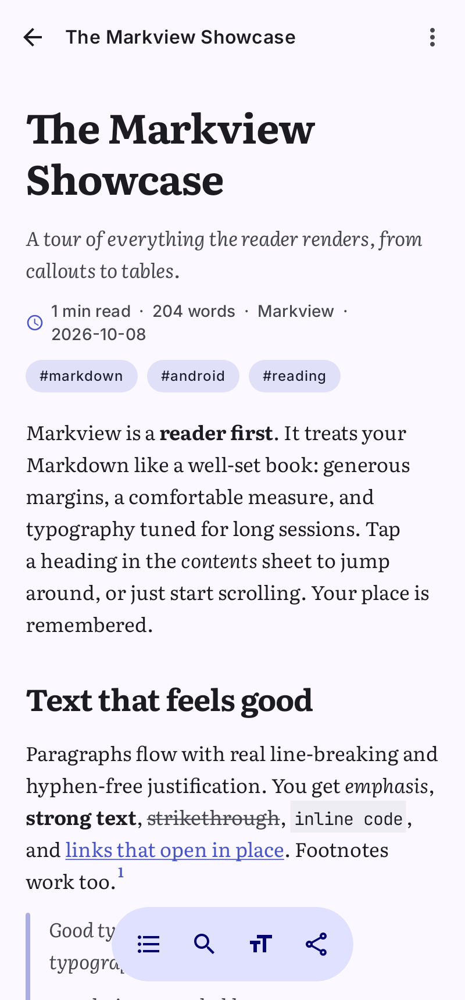
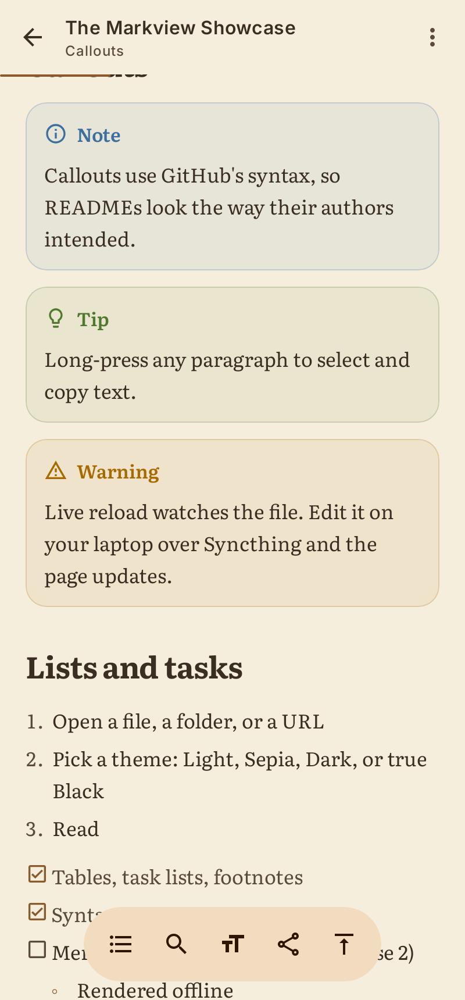
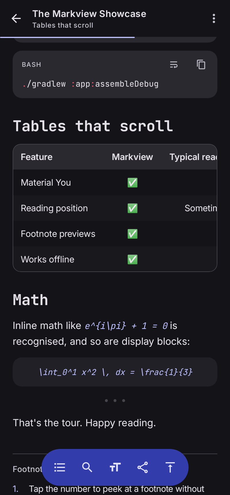
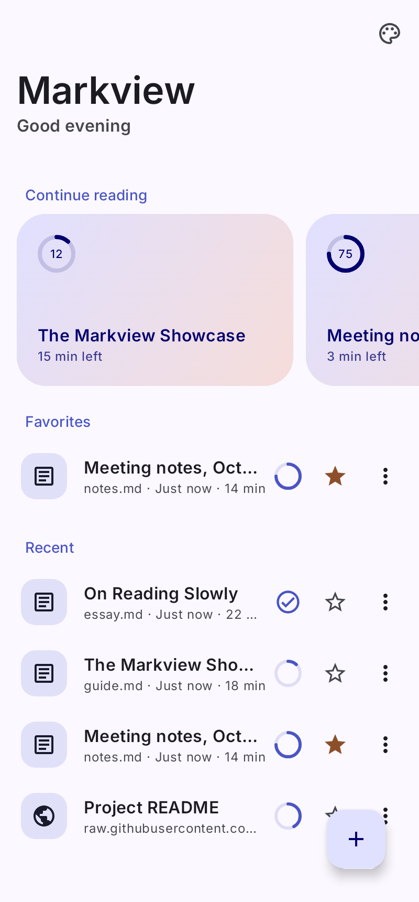

# Markview

A modern, native Markdown **reader** for Android. It is built with Kotlin, Jetpack Compose, and Material 3 Expressive.

Most Markdown apps on Android are editors that can also show a preview. Markview is the opposite: it is built around reading first, like a good e-reader. It has generous typography, a comfortable line length, and themes for long sessions. It remembers your place in every document.

<p align="center">
  
  
  
  
</p>

## Features

### Reading
- **Typography presets:**
  - *Editorial* uses Literata.
  - *Modern* uses Inter.
  - *Technical* uses Inter with JetBrains Mono headings.
  - You can also adjust text size, line spacing, and the maximum line width.
- **Themes:** System, Light, Sepia, Dark, and true Black (OLED), plus Material You dynamic color.
- **Reading position memory** per document, a progress bar, and "Continue reading" cards that show time left.
- **Table of contents** sheet that highlights the current section. The top bar shows which section you're in.
- **Find in document** highlights every match and lets you step through them.
- **Footnote peek:** tap a footnote number to read it in a sheet without losing your place.
- **Live reload:** when the file changes on disk (Syncthing, a laptop editor…), the page updates in place.
- **Images:** pinch-zoom full-screen viewer. SVG badges are supported, and README badge rows wrap like they do on GitHub.

### Markdown support
- CommonMark plus GitHub Flavored Markdown: tables, task lists, strikethrough, autolinks.
- GitHub-style callouts (`> [!NOTE]`, `[!TIP]`, `[!IMPORTANT]`, `[!WARNING]`, `[!CAUTION]`).
- Footnotes, YAML front matter (shown as a title, summary, author, date, and tag header), and HTML image blocks.
- Syntax highlighting for 18 languages, with copy and line-wrap toggles.
- Wide tables and code scroll horizontally inside their own containers.
- `$inline$` and `$$display$$` math is parsed. Typeset rendering is on the roadmap.

### Opening documents
- **Open with / share to Markview** from any file manager, email, or chat app.
- **Folders:** grant a folder once and browse its Markdown files. Relative links and images resolve inside it.
- **Open from URL:** GitHub, GitLab, Codeberg, and gist URLs are converted to raw files automatically, and relative images load from the source.
- **Paste** Markdown or a link from the clipboard.
- Links between `.md` files open in the app with a proper back stack, and `#anchors` scroll to their heading.

### Privacy
No accounts, analytics, ads, or Google Play Services. The network is only used for documents and images you open.

## Architecture

```
app/                 Activity, navigation, intent handling
core/markdown/       Pure-JVM parser: commonmark-java → immutable MdDocument model (+ math extension)
core/render/         Compose-native renderer: one LazyColumn item per block, AnnotatedString inlines
core/designsystem/   Theme (brand, sepia, black, dynamic), fonts, settings panel
core/data/           DataStore-backed library/settings, SAF + HTTP document loading, link resolution
feature/home/        Library, folder browser, open/paste/URL flows
feature/reader/      Reader screen, TOC, search, footnotes, image viewer
```

Rendering is fully native Compose rather than a WebView. Each top-level block is one lazy-list item, which gives three benefits:
- Large documents stay smooth.
- Block indices act as stable anchors for the table of contents, search, and saved positions.
- Theming, selection, and scrolling feel like the rest of Android.

See [docs/PLAN.md](docs/PLAN.md) for the product plan and roadmap. Next up are the following:
- Mermaid and typeset math, rendered offline to SVG
- Focus mode and read-aloud
- Quick edit
- PDF export
- Nostr long-form (NIP-23) reading and publishing

## Building

Requirements: JDK 17+ and the Android SDK (compileSdk 37).

```bash
./gradlew assembleDebug          # app/build/outputs/apk/debug
./gradlew test                   # unit tests + Robolectric screenshot tests
./gradlew lintDebug
```

Screenshot tests (`app/src/test/.../ScreenshotTest.kt`) render real screens on the JVM with Robolectric and Roborazzi. They write PNGs to `docs/screenshots/`, and the images in this README come from them.

Fonts and libraries are listed in [THIRD_PARTY_NOTICES.md](THIRD_PARTY_NOTICES.md).
