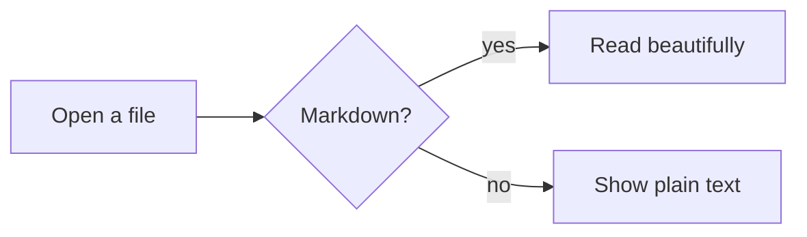

Markview is a **reader first**. It treats your Markdown like a well-set book: generous margins, a comfortable measure, and typography tuned for long sessions. Tap a heading in the *contents* sheet to jump around, or just start scrolling. Your place is remembered.

## Text that feels good

Paragraphs flow with real line-breaking and hyphen-free justification. You get *emphasis*, **strong text**, ~~strikethrough~~, `inline code`, and [links that open in place](#tables-that-scroll). Footnotes work too.[^1]

> Good typography is invisible. Bad typography is everywhere.
>
> — a designer, probably

## Callouts

> [!NOTE]
> Callouts use GitHub's syntax, so READMEs look the way their authors intended.

> [!TIP]
> Long-press any paragraph to select and copy text.

> [!WARNING]
> Live reload watches the file. Edit it on your laptop over Syncthing and the page updates.

## Lists and tasks

1. Open a file, a folder, or a URL
2. Pick a theme: Light, Sepia, Dark, or true Black
3. Read

- [x] Tables, task lists, footnotes
- [x] Syntax highlighting
- [x] Mermaid diagrams and typeset math
  - Rendered offline
  - Tap a diagram to zoom

## Code

```kotlin
fun greet(name: String): String {
    // Highlighted with a pure-Kotlin highlighter
    val greeting = "Hello, $name!"
    return greeting.uppercase()
}
```

```bash
./gradlew :app:assembleDebug
```

## Tables that scroll

| Feature | Markview | Typical reader |
|:--|:--:|--:|
| Material You | ✅ | ❌ |
| Reading position | ✅ | Sometimes |
| Footnote previews | ✅ | ❌ |
| Works offline | ✅ | ✅ |

## Math

Inline math like $e^{i\pi} + 1 = 0$ sits on the baseline, even with fractions such as $\sum_{k=1}^{n} k = \frac{n(n+1)}{2}$. Display equations are centred:

$$
\int_0^1 x^2 \, dx = \frac{1}{3}
$$

## Diagrams



## Read it to me

Tap the headphones to hear this document read aloud with your phone's own voice. The paragraph being read is highlighted, and the page follows along. Focus mode dims everything except the paragraph you're on.

---

That's the tour. Happy reading.

[^1]: Tap the number to peek at a footnote without losing your place.
